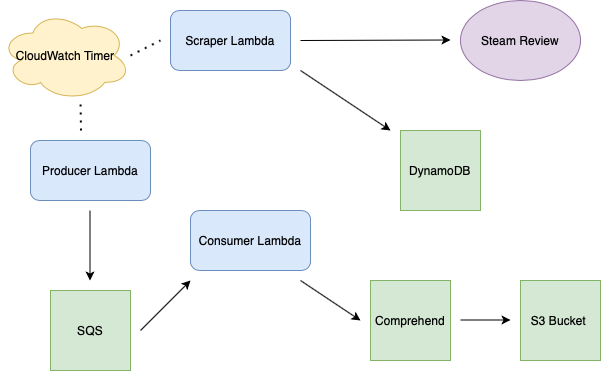

# Serverless Data Engineering Pipeline on AWS

Final project for MIDS IDS 706

## Project Goal
* To create a serverless game review data pipeline on AWS
* To use AWS Comprehend API for sentiment analysis and phrase extraction
* To provide game product improvement insights from review analysis
* To gain fluency in using AWS toolkits, with an emphasis on Cloud9, Lambda, DynamoDB, SQS, and S3

## Pipeline Architecture 

### Scraper Lambda
* Triggered by CloudWatch Timer
* Scrapes real-time game review from steam community on *Sekiro*
* Stores review in AWS DynamoDB

### Dynamo2SQS Lambda
* Triggered by CloudWatch Timer
* Reads information stored in AWS DynamoDB
* Passes information to AWS SQS

### Consumer Lambda
* Triggered by SQS input activity
* Passes review to AWS Comprehend for sentiment analysis and key phrase detection
* Writes review and NLP results into an S3 bucket.

### Projec Demonstration 
[)](https://youtu.be/4Vcb9lSpwSo)

#### Team Members
Shangwen Yan: [@shangwenyan](https://github.com/shangwenyan)

Yi Feng: [@notfy111](https://github.com/notfy111)
